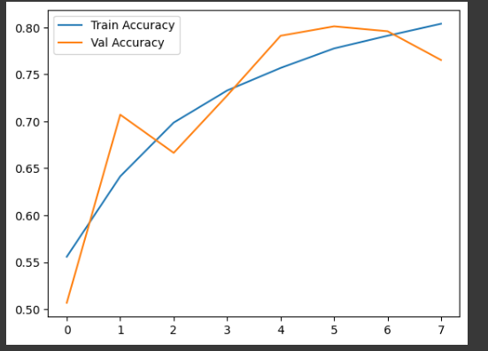
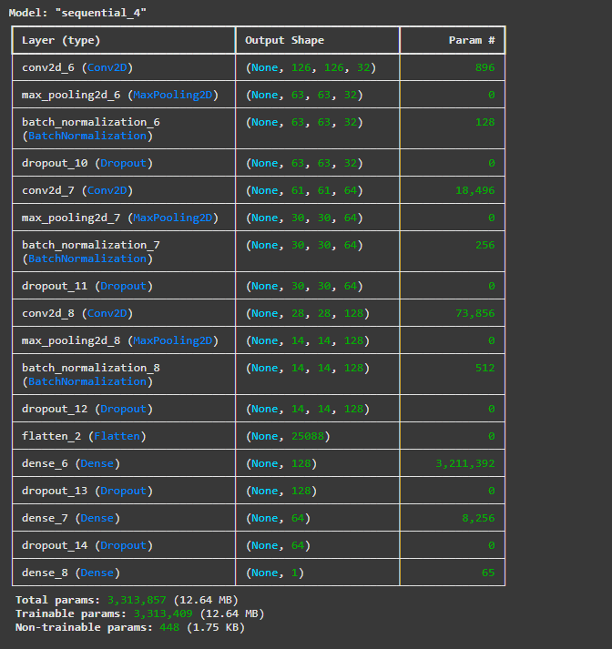

#  Cat vs Dog Classifier using CNN (TensorFlow/Keras)
This project is a CNN(convolution Neural Network) model trained to differentiate images either **cats** or **dogs**. tensorFlow/keras are used to train and built this project on Google colab.

---
## 🚀 Project Highlights

- **Dataset**: 20,000 training + 5,000 testing images (Cats & Dogs)
- **Model**: CNN with Conv2D, MaxPooling2D, Flatten, Dense layers
- **Validation Accuracy**: Achieved **~80.1%**
- **Prediction**: Successfully predicts real-world Google images

---

---
## 📊 Training Performance

- Early stopping after 8 epochs
- Best validation accuracy: **~80.1%**
- Shows improvement with each training round

---

## Project

📁 cnn-dog-vs-cat
├── cat_dog_classifier.ipynb 
├── model
├── images
└── README.md 

 ## Prediction
 graph of validation accuracy vs training accuracy
 

 ## Parameters
 Total parameters of model
 
